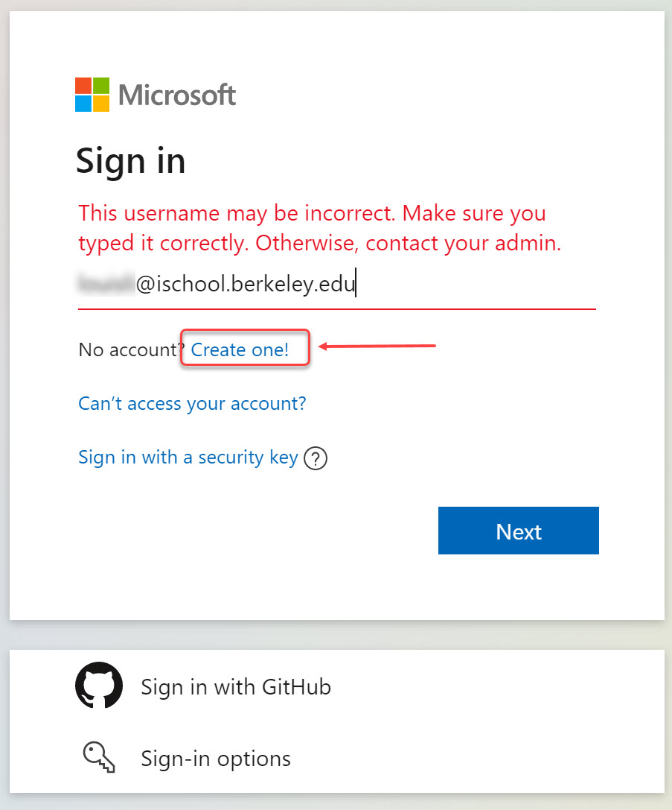
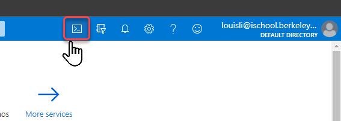
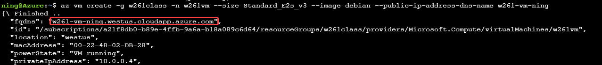

# Setting Up your VM for Hadoop

## Azure Student Credit

Microsoft Azure provides $100 credit for students valid for 12 months. You will be asked to provide your school email address and name. An email will be sent to you to confirm these details before a coupon is sent to you:

- You will be asked for a name and email address, which needs to match the school. A confirmation email will be sent to you with an activity code.

Here is the url:
https://azure.microsoft.com/en-ca/free/students/

Before applying for the credit, you will need to sign up Azure access using your school email. 


Once you can sign in Azure using your school email, you can sign in and apply for the student credit. It will send an activation email to your school email shortly.

## Create your Instance

1. Log into you Azure with your school email:

https://portal.azure.com/


2. Click on the Cloud Shell icon



3. Follow the instructions to setup Cloud Shell

4. Run the following command, replace the "<use your id or something unique here>" in the second command to make it unique

```
az group create --name w261 --location westus
az vm create -g w261 -n w261 --size Standard_E2s_v3 --image debian --storage-sku Standard_LRS --public-ip-address-dns-name w261-vm-<use your id or something unique here>
```

5. Then setup your password for VM access, replace "<setup your password>" with your password

```
az vm user update -u azureuser -p <setup your password> -n w261 -g w261
```

6. When VM is created, the fqdns is the public VM url you will need to connect to the VM from your laptop



7. Now use SSH client on your local laptop and log into the new VM:

```
ssh w261 \
  --ssh-flag="-L 8889:127.0.0.1:8889" \
  --ssh-flag="-L 8088:127.0.0.1:8088" \
  --ssh-flag="-L 19888:127.0.0.1:19888" \
  --ssh-flag="-L 4040:127.0.0.1:4040" \
  --ssh-flag="-L 41537:127.0.0.1:41537"
```


## Setup Docker

```
sudo apt-get update
sudo apt-get install -y \
     apt-transport-https \
     ca-certificates \
     curl \
     gnupg \
     lsb-release
curl -fsSL https://download.docker.com/linux/debian/gpg | sudo gpg --dearmor -o /usr/share/keyrings/docker-archive-keyring.gpg
echo \
  "deb [arch=amd64 signed-by=/usr/share/keyrings/docker-archive-keyring.gpg] https://download.docker.com/linux/debian \
  $(lsb_release -cs) stable" | sudo tee /etc/apt/sources.list.d/docker.list > /dev/null
sudo apt-get update
sudo apt-get install -y docker-ce docker-ce-cli containerd.io
sudo usermod -aG docker $USER
sudo systemctl enable docker.service
sudo systemctl enable containerd.service
```

## Setup Docker Compose
```
sudo curl -L "https://github.com/docker/compose/releases/download/1.29.1/docker-compose-$(uname -s)-$(uname -m)" -o /usr/local/bin/docker-compose
sudo chmod +x /usr/local/bin/docker-compose
```


## Connect to Jupyter Lab
Now run Docker Compose to run Hadoop cluster